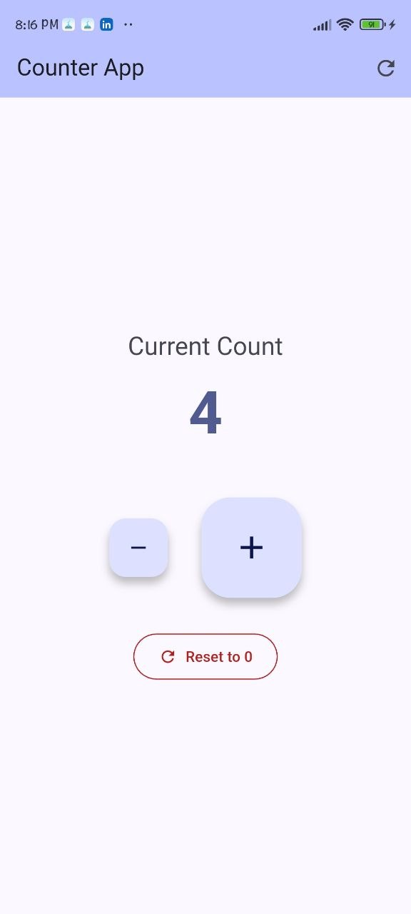
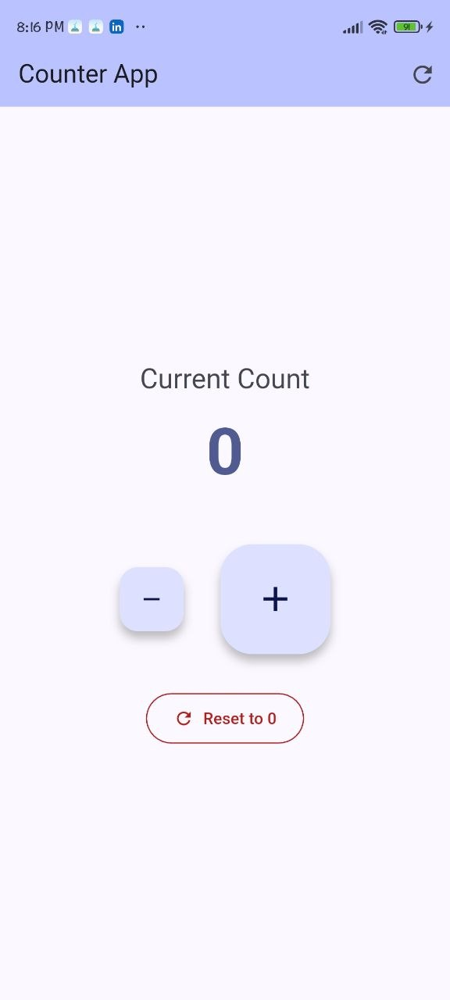

# Counter App

A simple Flutter application that demonstrates state management by incrementing, decrementing, and resetting a counter.

## Data Persistence
This project uses the `shared_preferences` package to save the counter value locally, ensuring it persists across app restarts.

## Widget Tree Overview
- `MyApp` (`MaterialApp`)
  - `HomePage` (`Scaffold`)
    - `AppBar` (Title and Reset Icon)
    - `Body` (`Center` > `Column`)
      - `Text` (Current Count Label & Value)
      - `Row` (`FloatingActionButton` for Decrement & Increment)
      - `OutlinedButton` (Reset button)

## Screenshots

