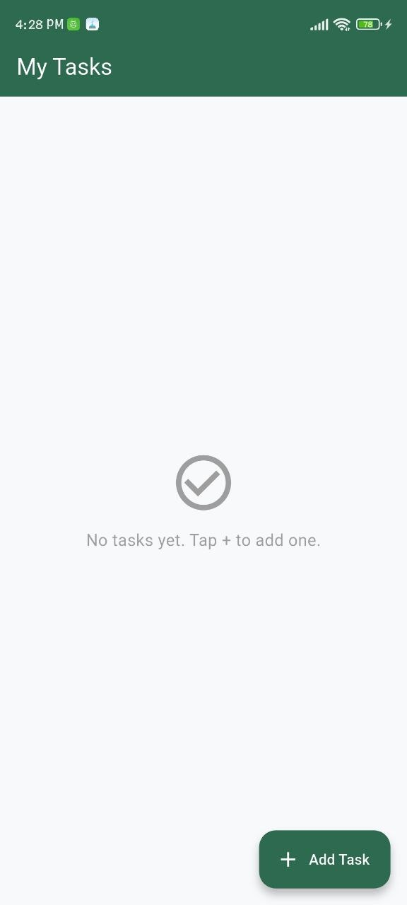
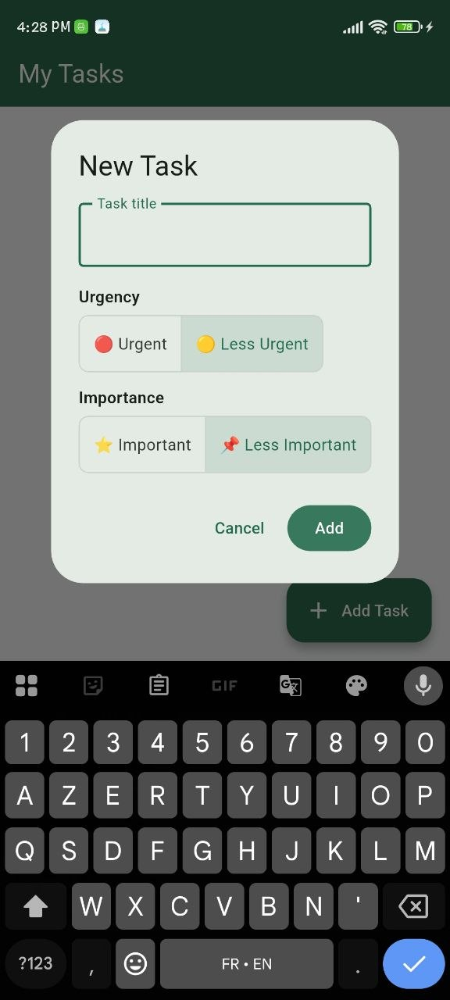

# Todo App

A simple Flutter application that allows users to manage their tasks with full CRUD operations and priority labeling using urgency and importance tags.

## Data Persistence
This project uses the `shared_preferences` package to save the list of tasks locally as a JSON-encoded string list, ensuring all tasks and their states persist across app restarts.

## Widget Tree Overview
- `MyApp` (`MaterialApp`)
  - `HomePage` (`Scaffold`)
    - `AppBar` (Title)
    - `Body` (`ListView`)
      - `Section Header` — Pending tasks
        - `Card` (`ListTile`)
          - `Checkbox` (Mark as done)
          - `Text` (Task title)
          - `Wrap` (Urgency & Importance tags)
          - `Row` (Edit & Delete `IconButton`s)
      - `Section Header` — Done tasks
        - `Card` (`ListTile`) — same structure, title struck through
    - `FloatingActionButton` (Add Task)
    - `AlertDialog` (Create / Edit task)
      - `TextField` (Task title input)
      - `ToggleButtons` (Urgency: Urgent / Less Urgent)
      - `ToggleButtons` (Importance: Important / Less Important)
    - `AlertDialog` (Delete confirmation)

## Screenshots

